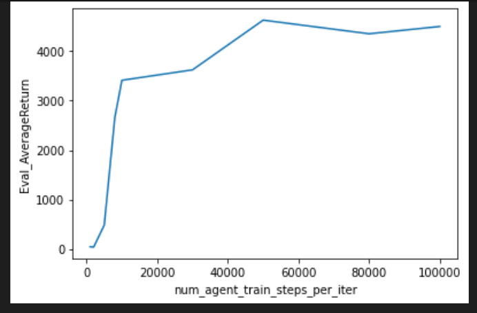
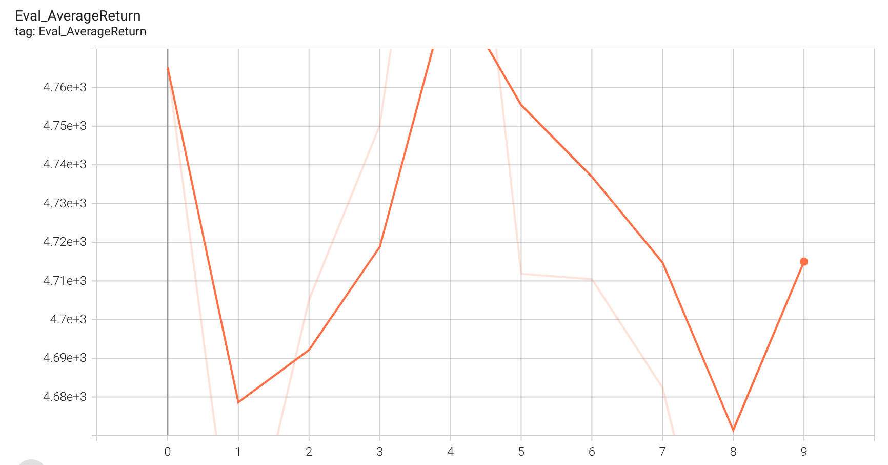
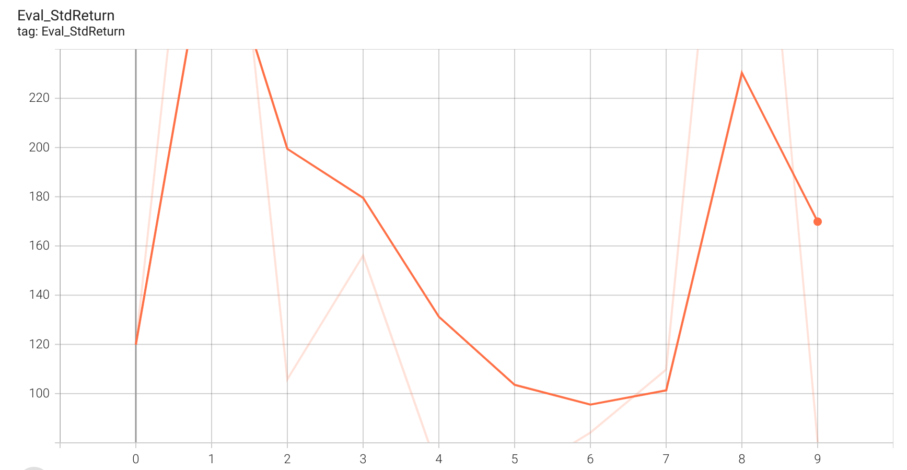
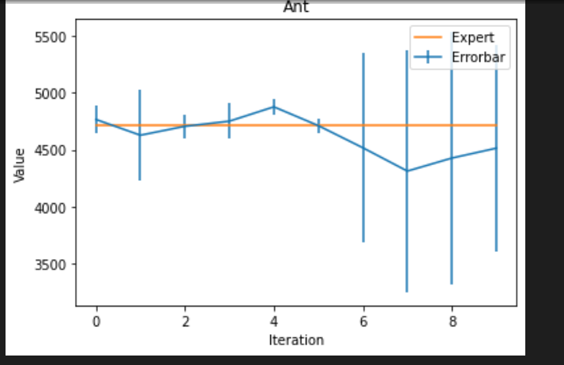
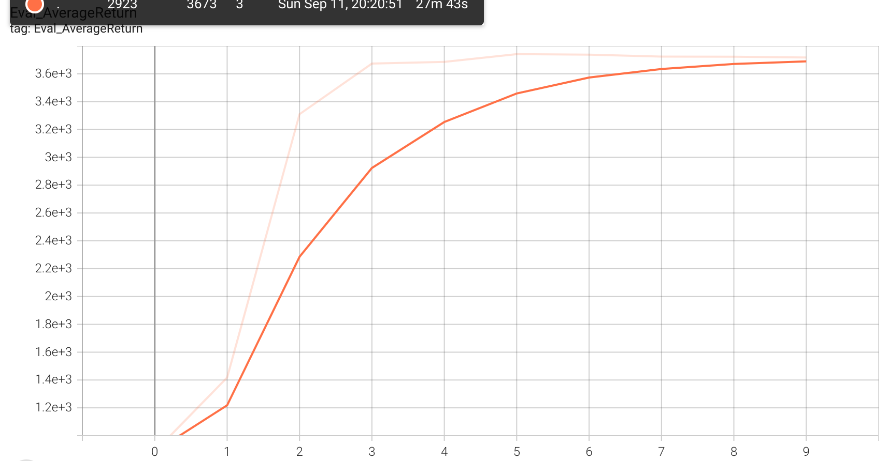
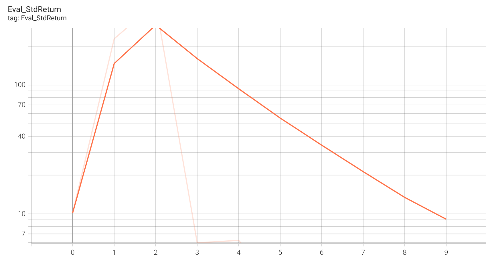
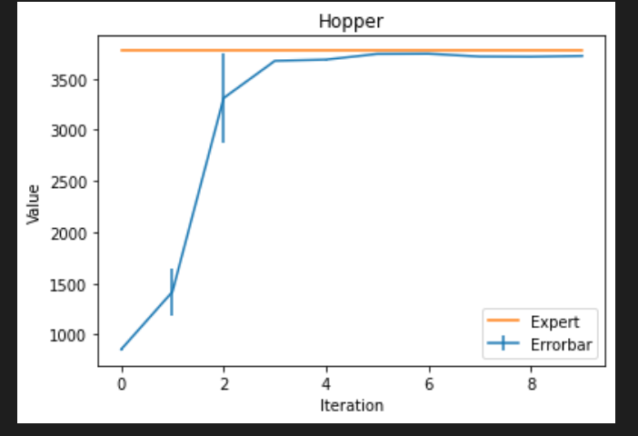

# HW 1 Report

Tianzhe Chu ID: 3038670325

## Q 1.2

| Environment | Expert(Train) | BC(Eval)       | Percent |
| ----------- | ------------- | -------------- | ------- |
| Ant         | 4713.65±12.20 | 4765.25±119.90 | 101.09% |
| Walker2d    | 5566.85±9.24  | 43.02±85.44    | 0.72%   |
| HalfCheetah | 4205.78±83.04 | 4052.89±103.92 | 96.36%  |
| Hopper      | 3772.67±1.95  | 885.88±10.22   | 23.48%  |

Above data are all under default condition with hyper paremeters as follows:

| Parameter                      | Value  |
| ------------------------------ | ------ |
| num_agent_train_steps_per_iter | 1000   |
| batch_size                     | 100000 |
| eval_batch_size                | 10000  |
| train_batch_size               | 100    |

According to the data, the efficiency of Ant environment achieves 101.09% of the expert.

While the efficiency of Walker2d only achieves only 0.72%, which is lower than 30%.

## Q 1.3

In regard to Walker2d environment, I tested the efficiency by tuning the hyper parameter:

num_agent_train_steps_per_iter.

| Value  | BC(Eval)        |
| ------ | --------------- |
| 1000   | 43.02±85.44     |
| 2000   | 36.18±81.06     |
| 5000   | 480.89±624.14   |
| 8000   | 2660.93±2043.44 |
| 10000  | 3412.61±2044.53 |
| 30000  | 3623.58±1314.26 |
| 50000  | 4629.73±1116.89 |
| 80000  | 4353.81±1765.51 |
| 100000 | 4501.30±1133.83 |

Reasons: The performance of Walker2d is not good when the num_agent_train_steps_per_iter is set 1000, due to lack of train steps.

## Q 2.2

Hyper parameters are the same with Q 1.2.

### Ant

Average:

Std

Errorbar:

The first iteration(labeled 0) displays the performance of behavior cloning while the following iterations shows the performance of DAgger.

Since the original performance of behavior cloning is good, DAgger doesn't improve the performance a lot.

### Hopper

Average:

Std:

Errorbar:

The first iteration(labeled 0) displays the performance of behavior cloning while the following iterations shows that DAgger significantly increases the performance. Meanwhile, DAgger also helps to reduce std, which increases the stability of the algorithm.
