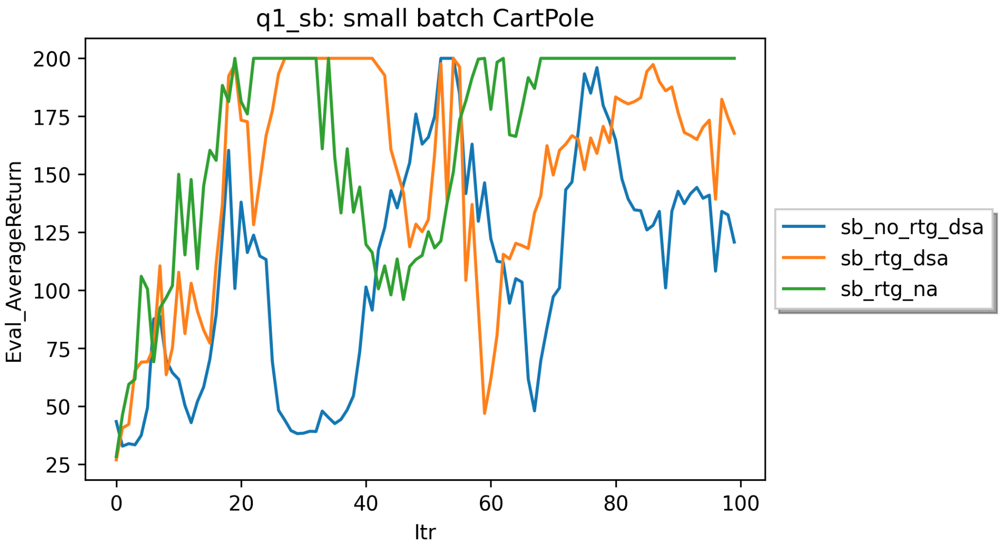
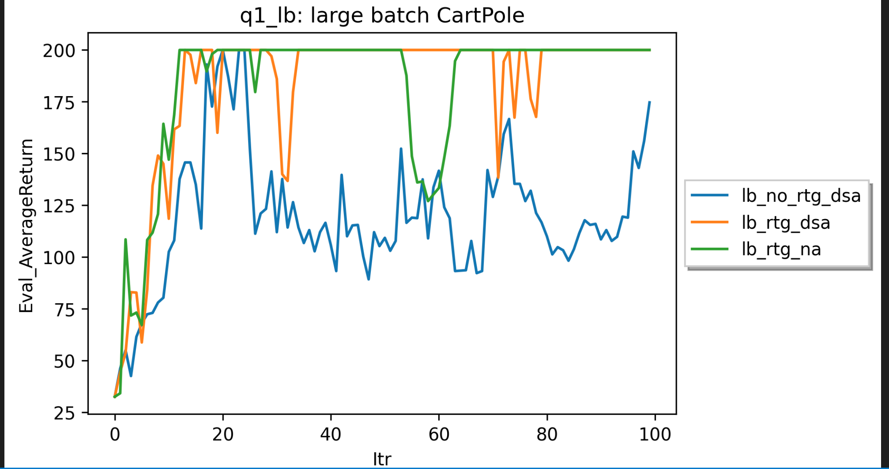
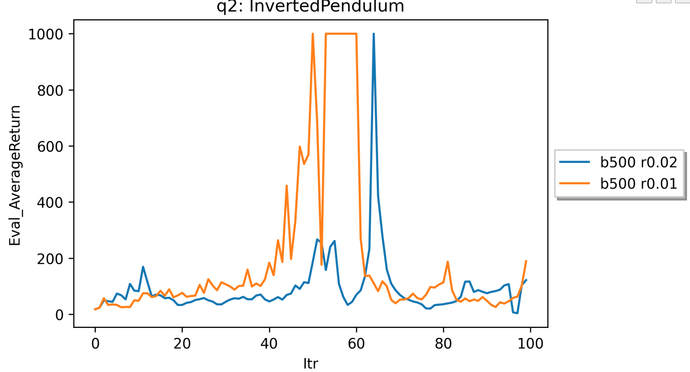
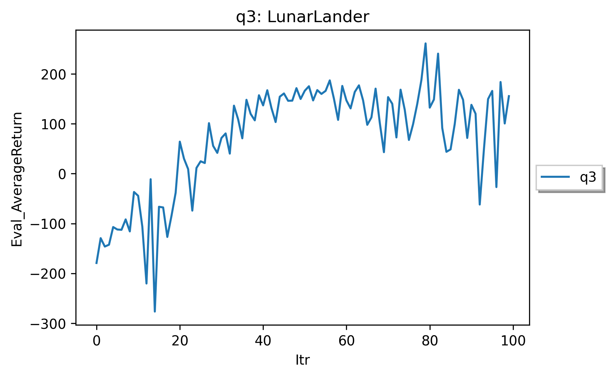
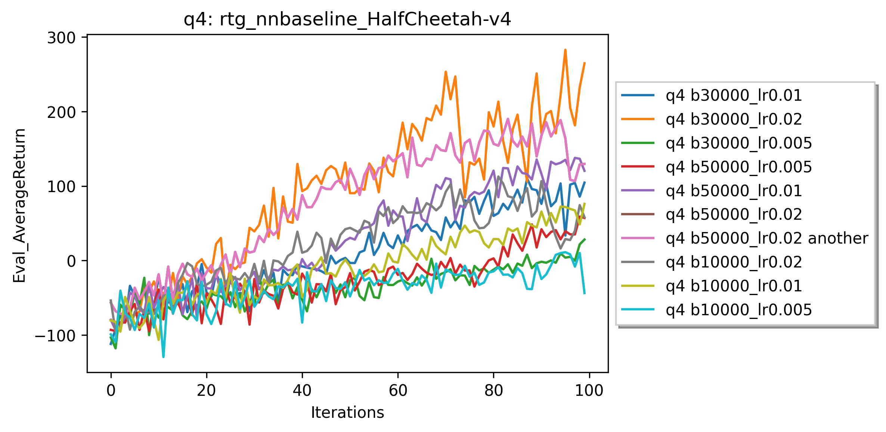
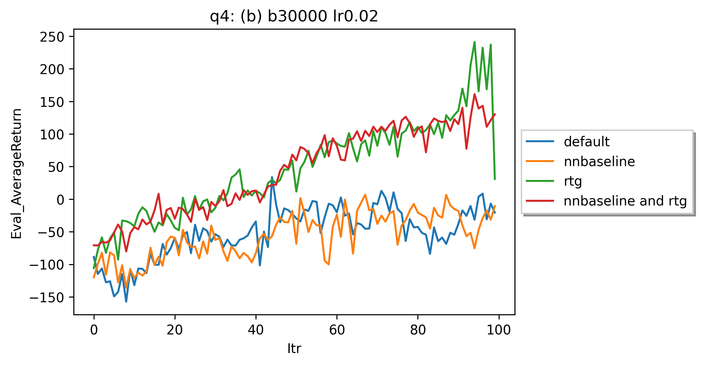
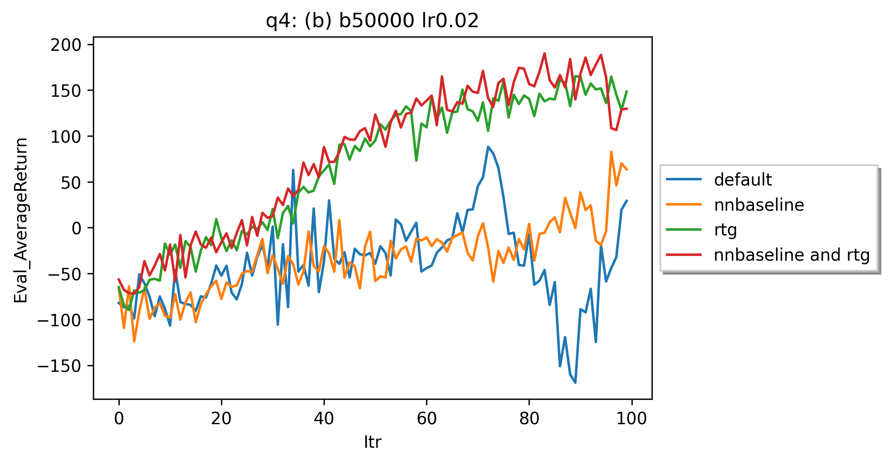
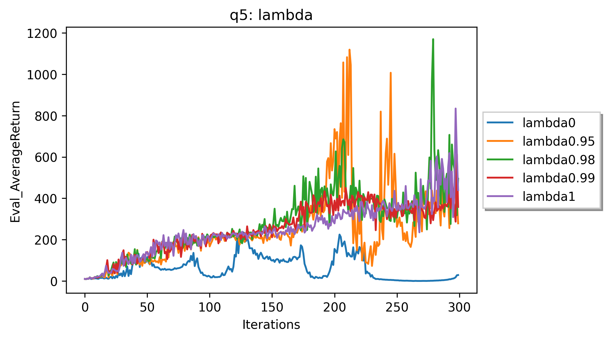

# HW2 Policy Gradient

## Experiment 1

### Small batch



### Large batch



### -Which better? rtg or trajectory centric?

Reward to go.

### -Did advantage standardization help?

In small batch, it did increase the performance. In large batch, it didn't help a lot.

### -Did batch size make an impact?

Yes. Large batch size increases the stability of the performance, and takes fewer iterations to reach 200.

## Experiment 2



The smallest batch size for reaching 1000 is 500 with largest learning rate 0.02. The performance is not very stable.

### Command:

```
`python cs285/scripts/run_hw2.py --env_name InvertedPendulum-v4 \

--ep_len 1000 --discount 0.9 -n 100 -l 2 -s 64 -b 500 -lr 0.02 -rtg \

--exp_name q2_b500_r0.02`
```


## Experiment 3



## Experiment 4

### (a)



The one with batch_size = 30000 and learning_rate = 0.02 performances the best. Meanwhile, the one with batch_size = 50000 and learning_rate = 0.02 also behaves well.

Large learning rate increases the speed of convergence. Large batch size increases the stability of performance.


### (b)

Since experiments with batch size of 30000 and 50000 both behave well, I applied both of them in this problem.

### 



## Experiment 5




$\lambda=0.98$, the performance achieves its best.


 

