# HW3

## Question 1: DQN

AverageReturn:

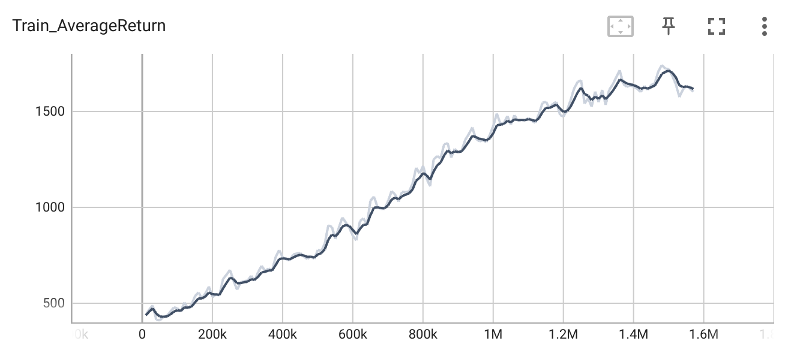

BestReturn:
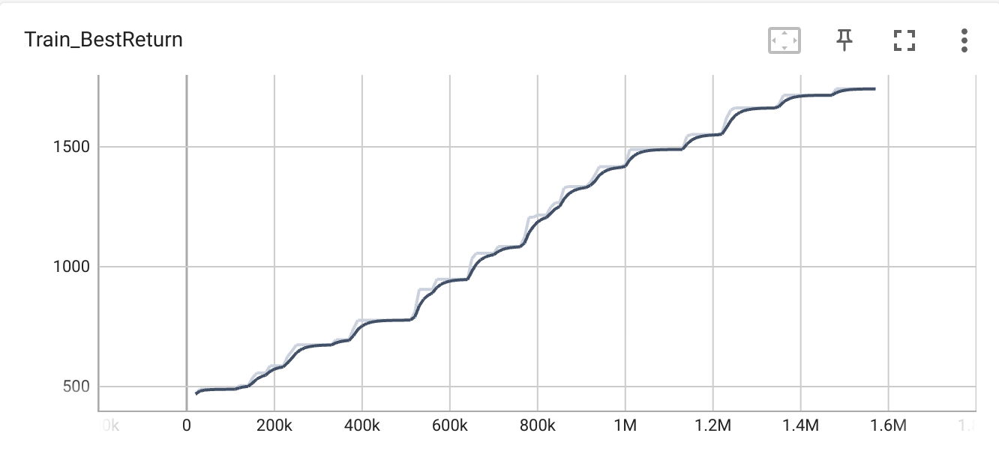

## Question 2: DDQN

### For DQN:

AverageReturn:

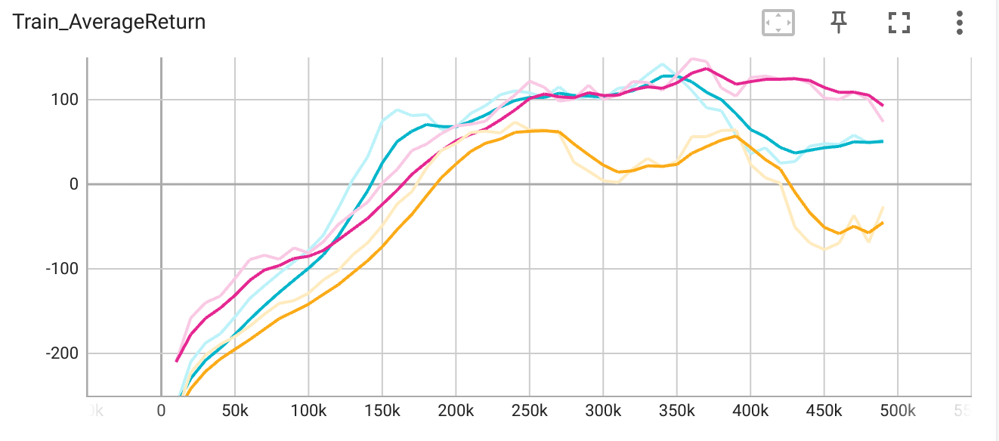

BestReturn

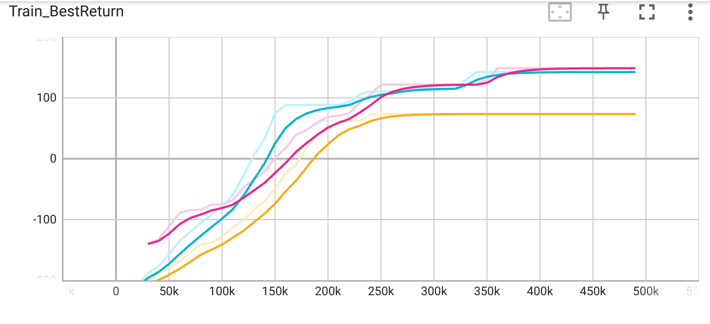

### For DDQN:

AverageReturn:

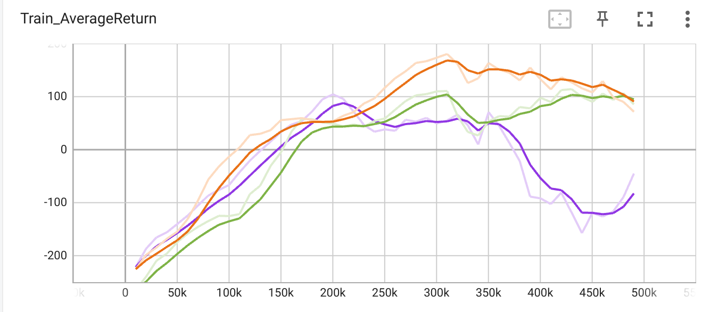

BestReturn:

'Train_AverageReturn'

## Question 3: Experiment

For learning rate = 1e-3, 2e-3, 3e-3:

AverageReturn:

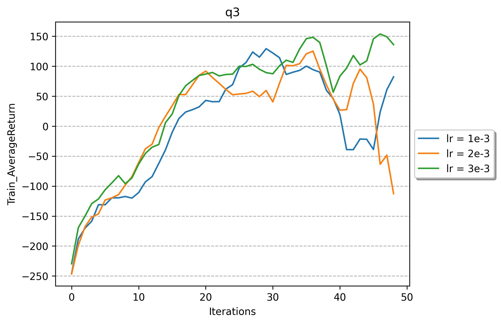

BestReturn:

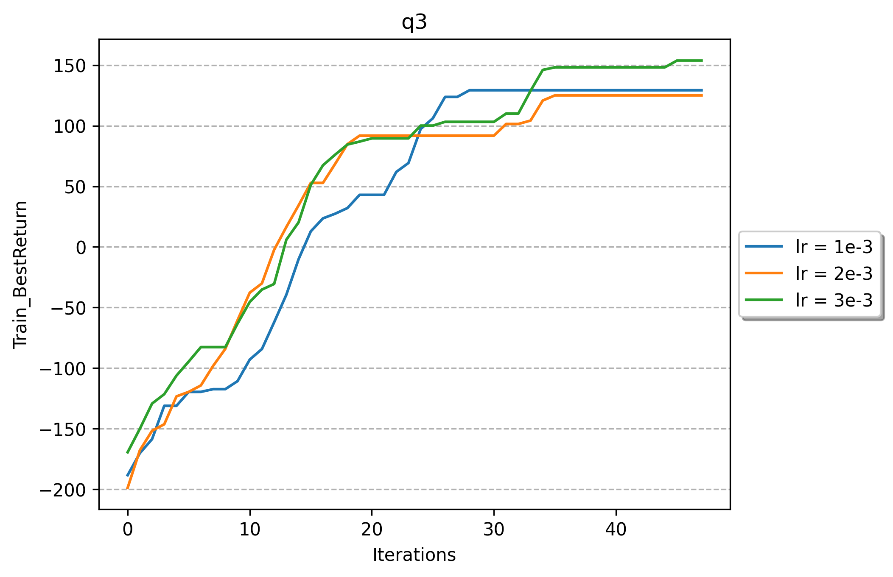

## Question 4: Actor-Critic

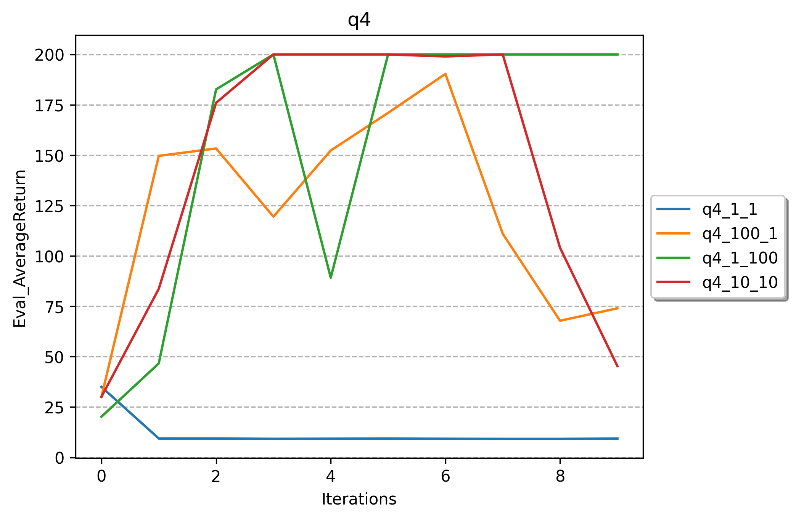

## Question 5: AC on more difficult task

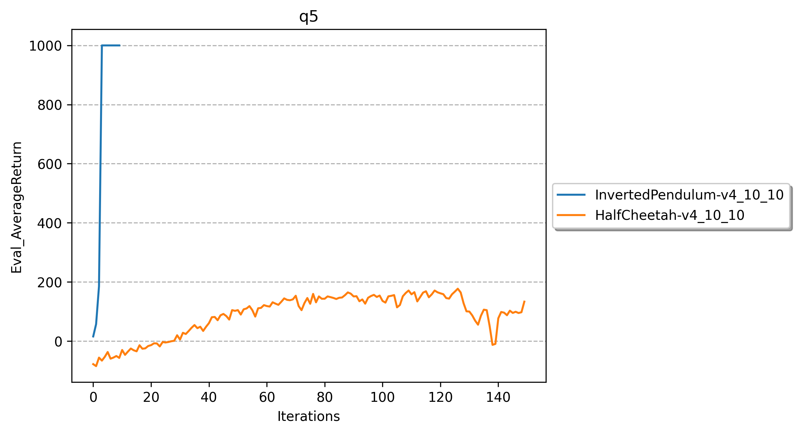

## Question 6: Soft Actor-Critic

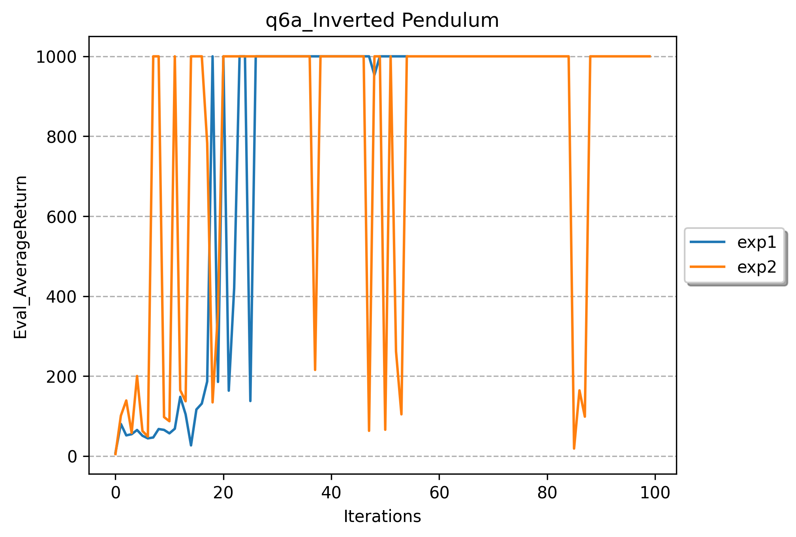

### Half Cheetah:

Before:

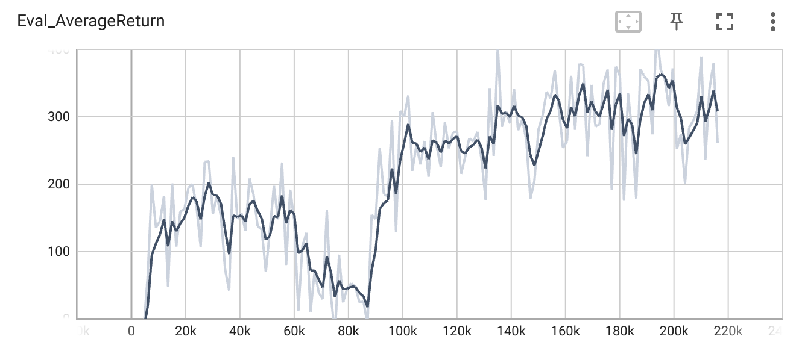

After fixing the critical bug:

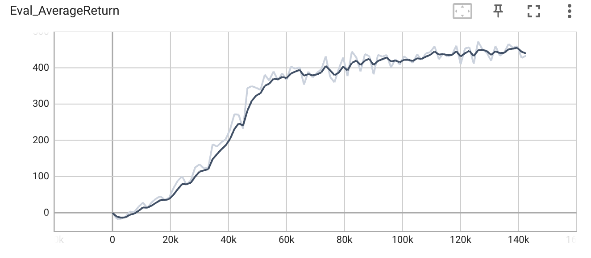

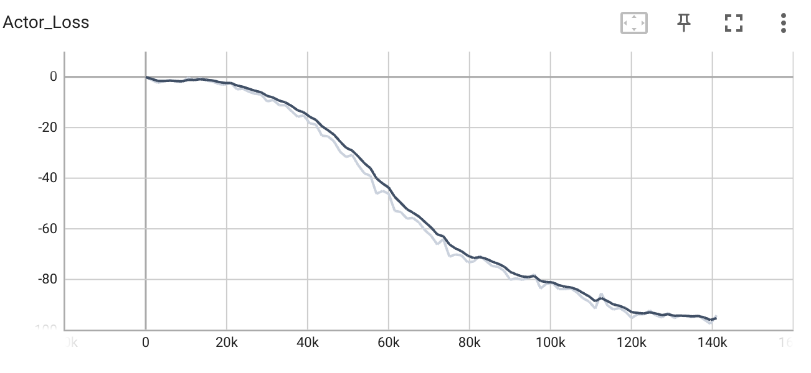