# HW4

## Problem 1

### Structure 1:

n=5, arch$2\times250$

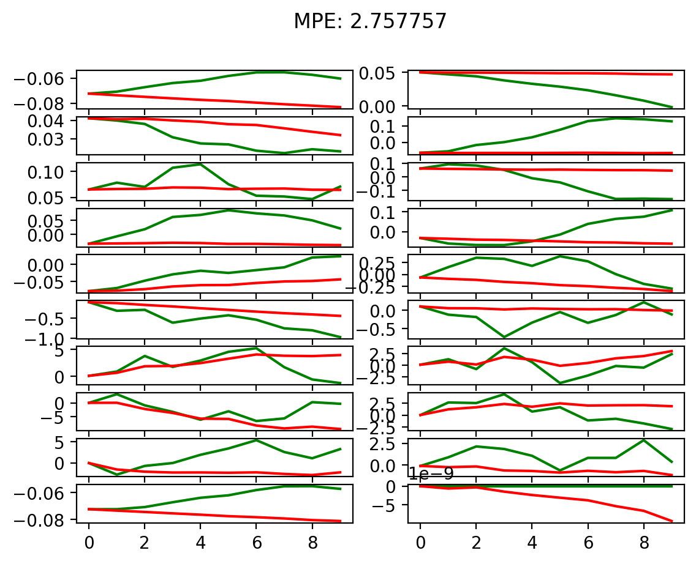

### Structure 2:

n=500, arch$1\times32$

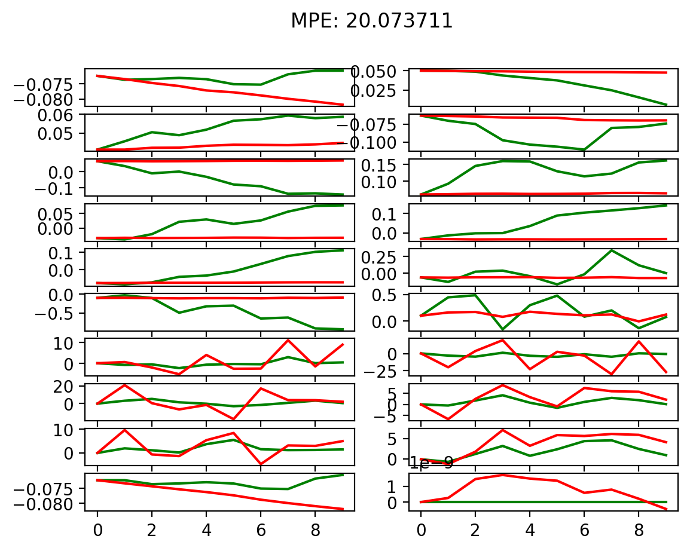

### Structure 3:

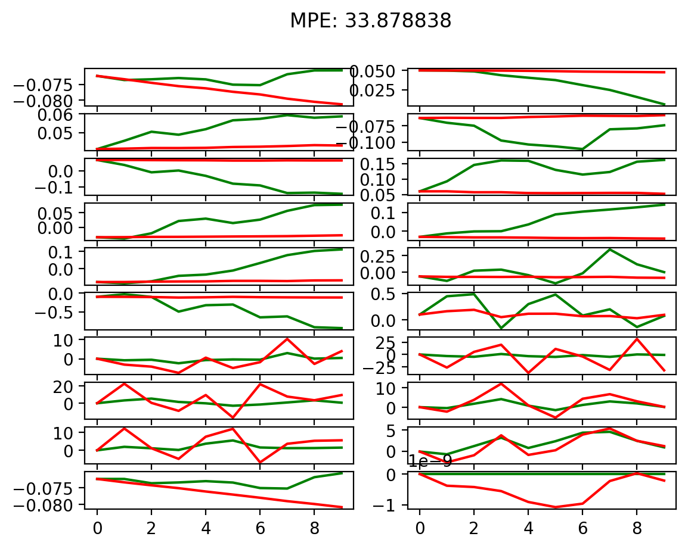

The first structure performs the best. It uses relatively smaller train steps and larger size and number of layers. It makes it less likely to be overfitting. Larger size somehow guarantees the size of features so that it can describe the true features better.

## Problem 2

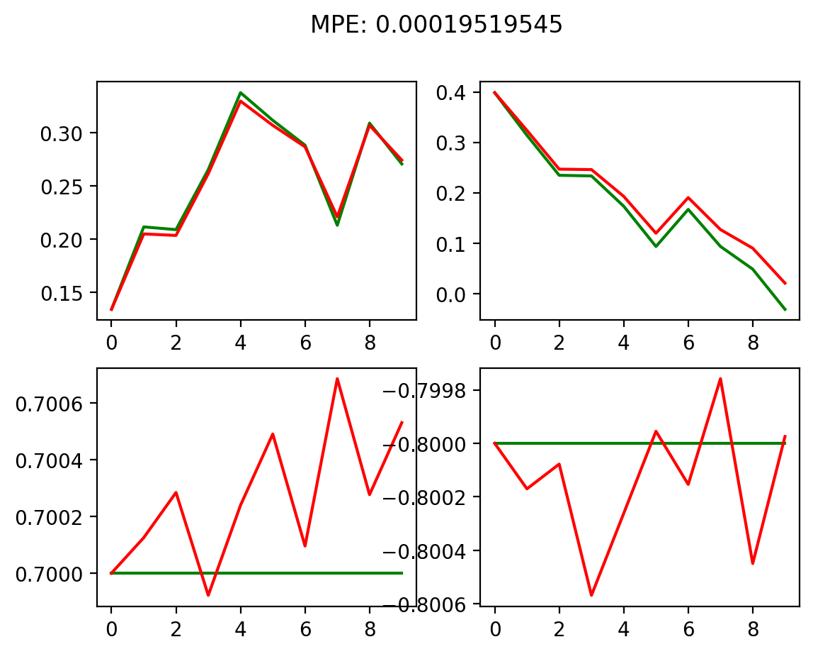

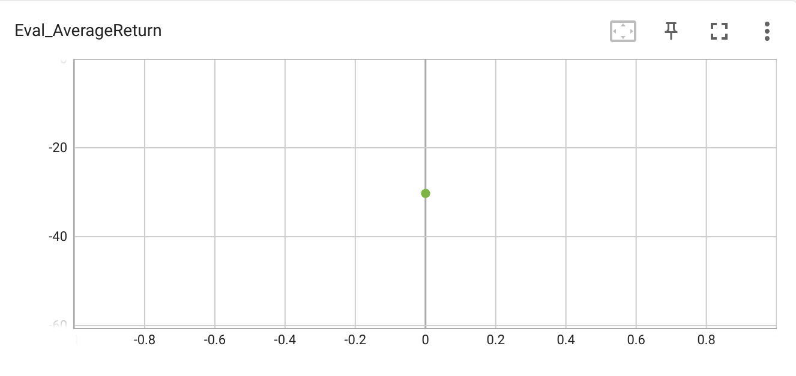

## Problem 3

### Obstacles:

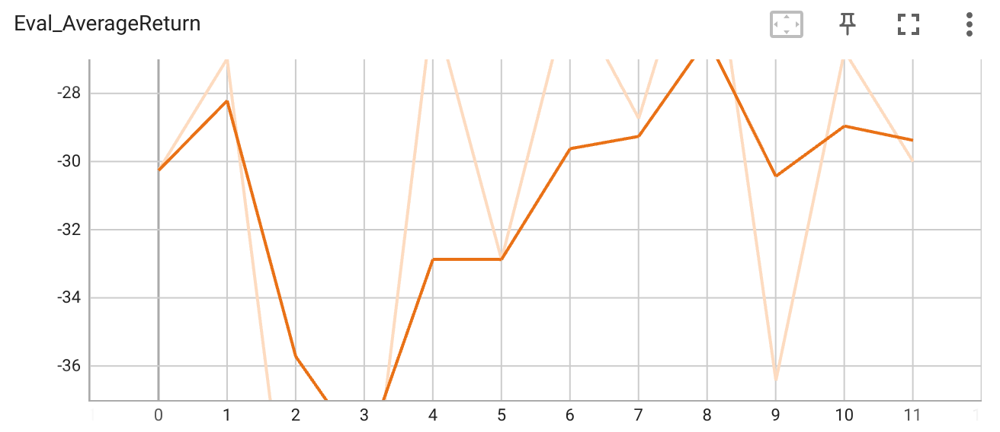

### Reacher

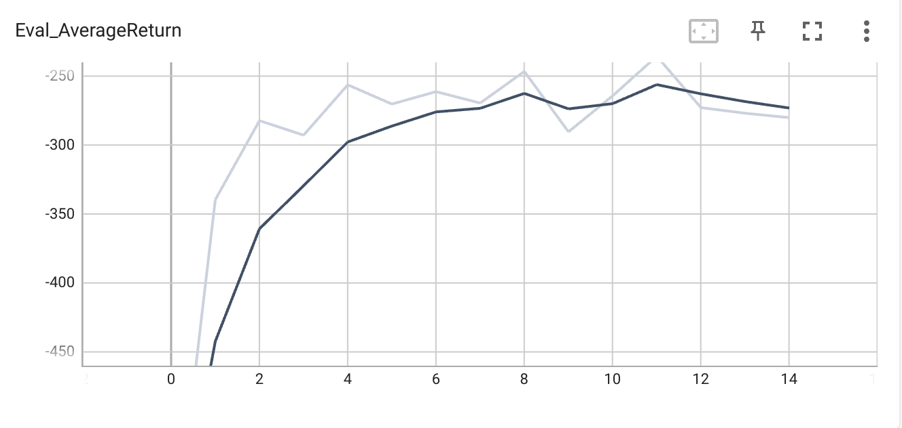

### Cheetah

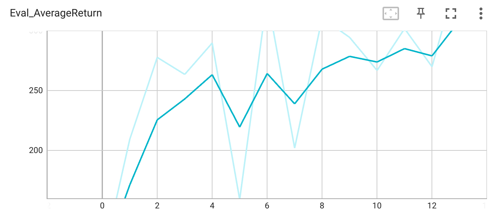

## Problem 4

### Different horizons:

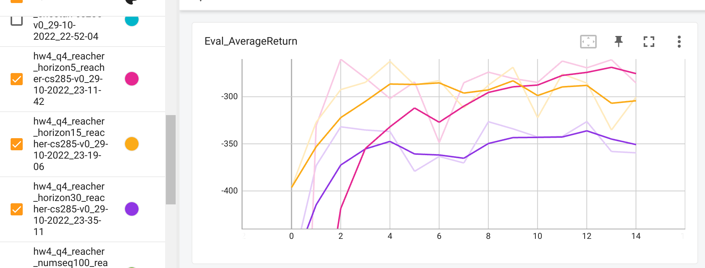

Lower horizon better

### Different numseqs:

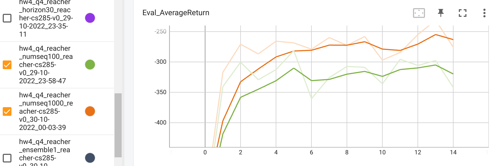

Higher numseq better

### Different ensembles:

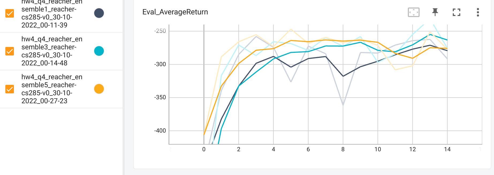

ensemble=3 better at last

## Problem 5

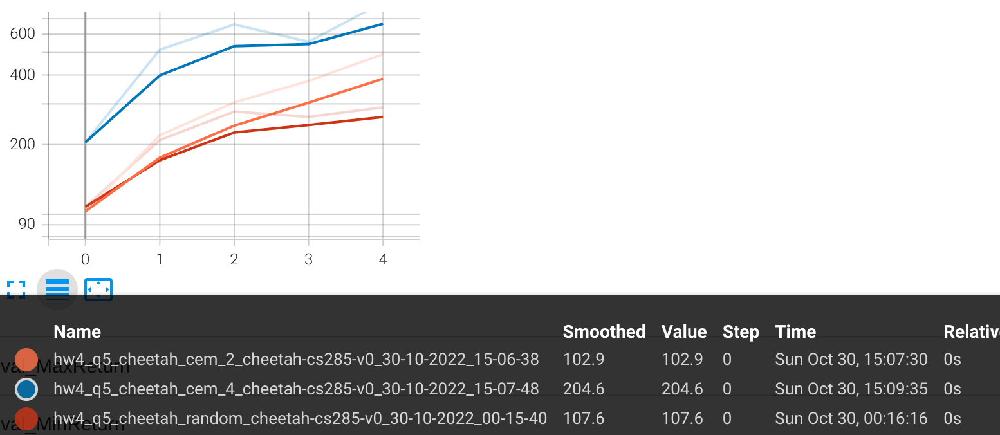

Performance: cem4 > cem2 > random

## Problem 6

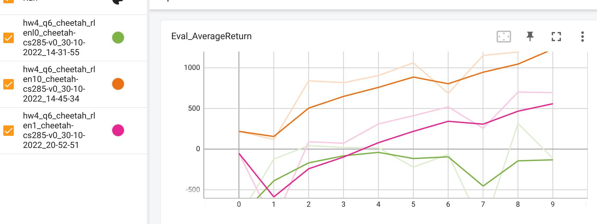

The one with rollout=10 performs the best.

Hence, larger rollout will lead to better performance.