# HW 5 Exploration and Offline RL

## Part 1

### For easy case

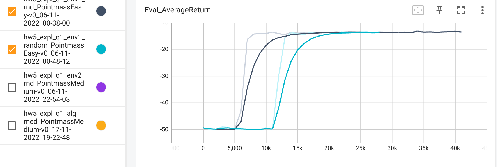

### For medium case in rnd and alg using boltzman

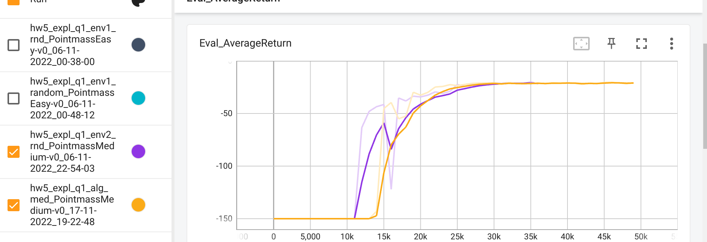

## Part 2 Offline RL on exploration

### For DQN

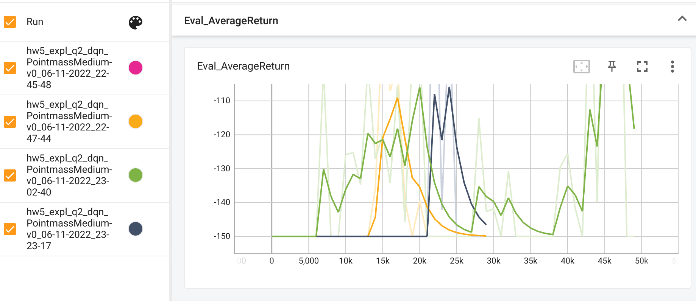

### For CQL

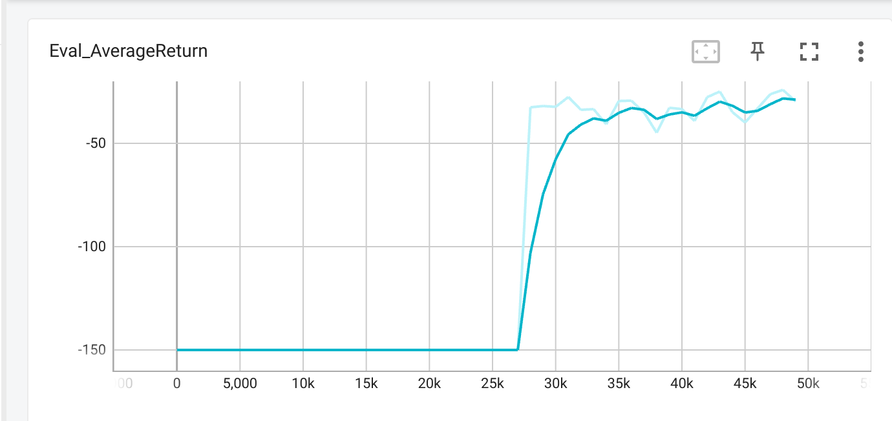

### For tuning numsteps

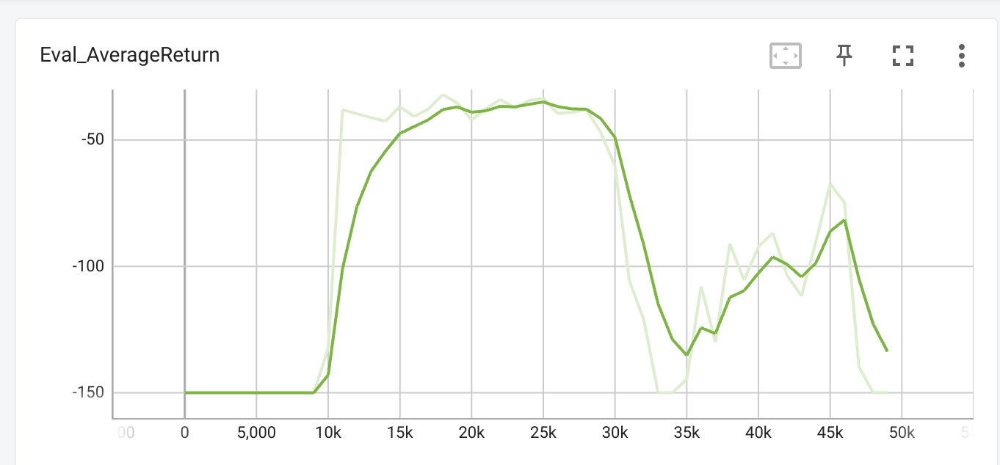

numsteps = 5000

### For tuning cql alpha

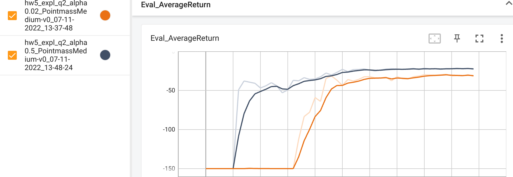

## Part 3 Supervised

### For medium cases

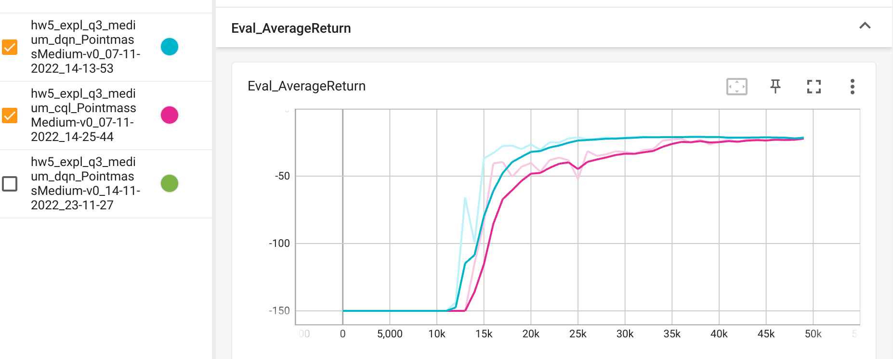

### For hard cases

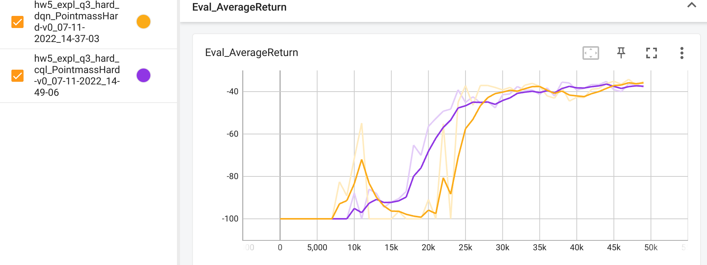

## Part 4 AWAC

### For easy

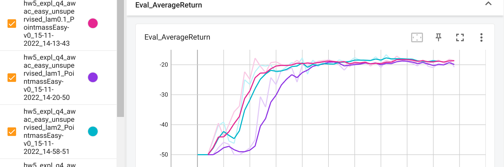

### For medium unsupervised (tuning lambda)

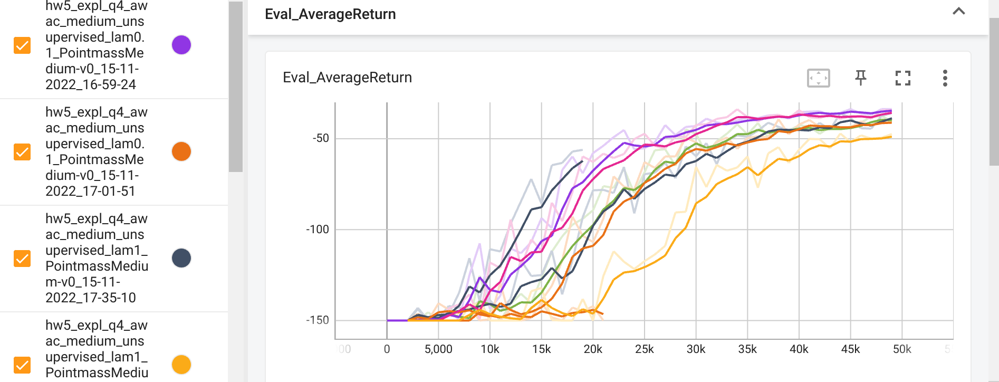

### For medium supervised (tuning lambda)

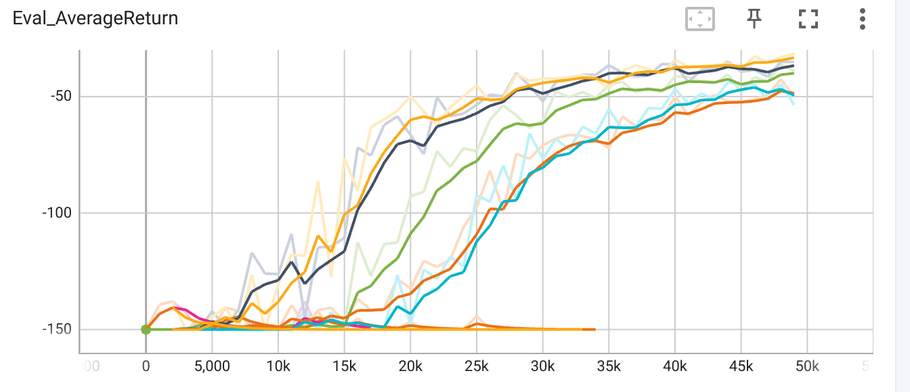

lambda = 10 is the best

## Part 5 IQL

### For easy unsupervised

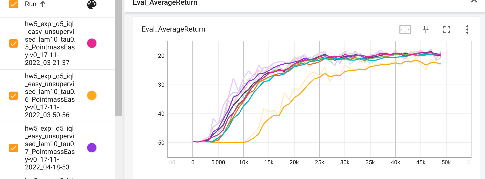

### For easy supervised

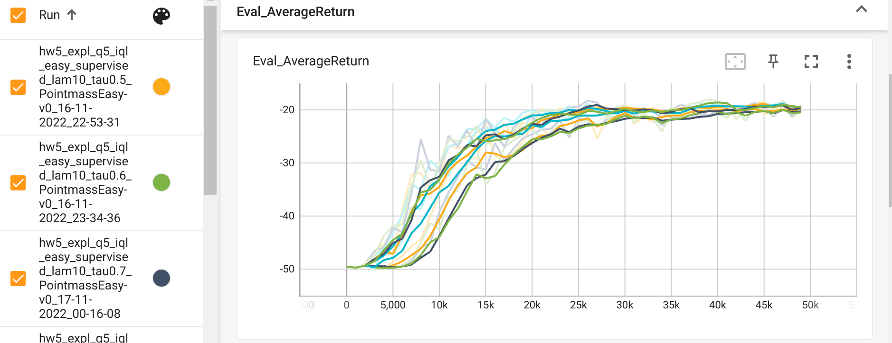

### For medium unsupervised

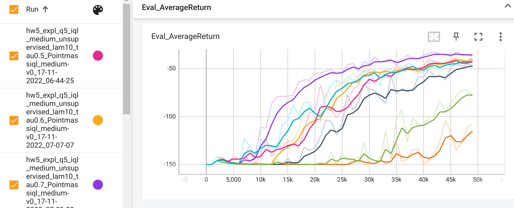

### For medium supervised

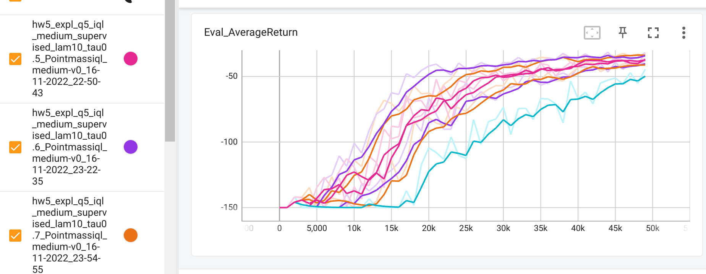